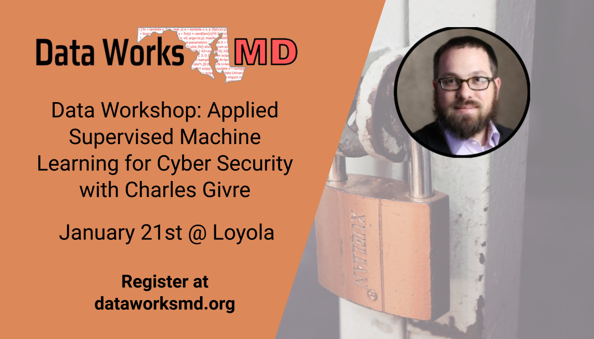

# Data Worshop: Applied Supervised Machine Learning for Cyber Security

Materials for Workshop about Applied Supervised Machine Learning for Cyber Security.

## Contents
Notebooks:
* [Worksheet: Applied Supervised Machine Learning](https://github.com/gtkcyber/dataworksmd_workshop/blob/master/Supervised%20Learning%20Worksheet.ipynb)
* [Answers:  Applied Supervised Machine Learning](https://github.com/gtkcyber/dataworksmd_workshop/blob/master/Supervised%20Learning%20Worksheet%20-%20Answers.ipynb)

Data:
* [DGA Features](https://github.com/gtkcyber/dataworksmd_workshop/blob/master/data/dga_features_final_df.csv) 

References:
* [Pandas Cheat Sheet](https://github.com/gtkcyber/dataworksmd_workshop/blob/master/references/Pandas_Cheat_Sheet.pdf)

## Presenter Information
Charles Givre CISSP
Email: charles.givre@gtkcyber.com

Website: [The Dataist](http://thedataist.com)

Brought to you by [GTK Cyber LLC](https://gtkcyber.com)

GTK Cyber LLC is presenting a 4 day course: Applied Data Science for Cyber Security from May 5-8, 2020.  
[Register now for a 25% early bird discount!](https://www.eventbrite.com/e/gtk-cyber-data-science-for-managersapplied-data-science-for-cybersecurity-tickets-84889832775)
